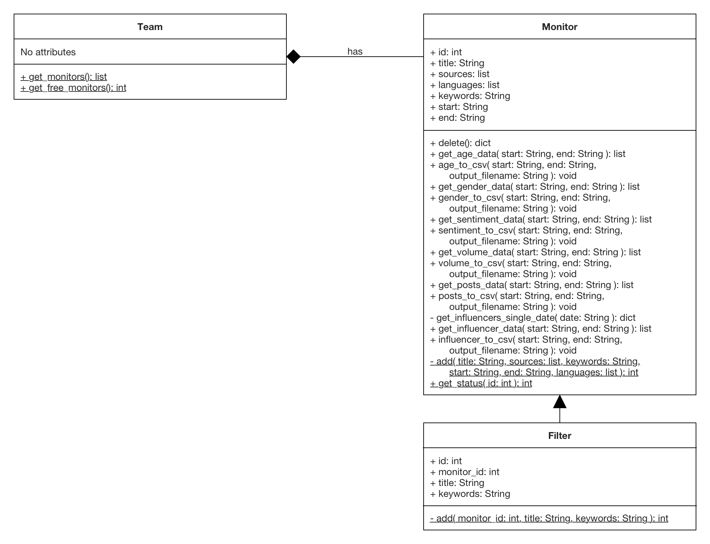

# Crimson Hexagon Python API-Wrapper

Make API- and UI-calls to Crimson Hexagon via Python.

[]()

---

## Table of Contents

- [Installation](#installation)
- [Usage](#usage)
- [Classes](#classes)
  - [Team](#team)
  - [Monitor](#monitor)
  - [Filter](#filter)

---

## Installation

1. Install Python 2.7: https://www.python.org/downloads/

2. Navigate to BuzzWrapper directory

3. Install Requirements (if just for current user with additional argument --user)
```shell
$ pip install -r requirements.txt
```
or
```shell
$ pip install -r requirements.txt --user
```

4. Set Enviroment Variables for Crimson Hexagon Login
```shell
$ export CH_USERNAME=<username>
$ export CH_PASSWORD=<password>
```

---

## Usage

In order to run scripts using the API-wrapper the necessary classes need to be imported first. Afterwards, feel free to use the classes however you like.

### Example

Prints list of daily volume for specified keywords and range of time to the console.

```python
from buzzwrapper import Team, Monitor, Filter

# Input
title_monitor = "Nike Twitter"
keywords_monitor = """ nike OR "air jordan" """
sources = ["twitter"]
languages = ["en"]
start_monitor = "2008-06-01"
end_monitor = "2018-06-01"
title_filter = "Air Jordan Last Month"
keywords_filter = """ "air jordan" """
start_filter = "2018-05-01"
end_filter = "2018-06-01"

# MAIN
number_of_free_monitors = Team.get_free_monitors()
if number_of_free_monitors > 0:
  new_monitor = Monitor(title=title_monitor, keywords=keywords_monitor, sources=sources,
    languages=languages, start=start_monitor, end=end_monitor)
  new_filter = Filter(monitor_id=new_monitor.id,
    title=title_filter, keywords=keywords_filter)
  volume_data = new_filter.get_volume_data(start=start_filter, end=end_filter)
  # Output
  print volume_data
  # Clean up
  new_monitor.delete()
```

For more extensive examples see [example.py](example.py) or [example_sequ.py](example_sequ.py).
To run an example-script run the following command:
```shell
$ python example.py
```

P.S.: While running the multithreaded script [example.py](example.py) on a dual-core machine I had to do "clean-up"
by visiting the filters the program had not yet gathered data for in my browser. The script was then able to
successfully download the data. The same issue did not occur on a quad-core machine and seems to be related to the maximum number of threads.

---

## Classes

This API-wrapper consists of three classes: Team, Monitor and Filter.
A Team can have up to ten monitors. Filters inherit from Monitors and can be viewed as a specialization.

### Team

A Team is an customer's organisation in the eyes of Crimson Hexagon. It can have up to ten monitors.

#### Attributes

Currently Teams do not have any attributes.

#### Operations

- `get_monitors()`: static method that returns list of monitors (https://apidocs.crimsonhexagon.com/v1.0/reference#monitor-list-1)
- `get_free_monitors()`: static method that returns number of free monitors

### Monitor

A Monitor is the basis of all operations on the Crimson Hexagon platform. It can be used to access volume, sentiment, age, gender, post and influencer data. While gathering data a Monitor has a status in percent that represents the progress in gathering the requested data.

#### Attributes

- `id`: unique integer that can be used to access an existing monitor
- `title`: title that has to be set when creating the monitor
- `sources`: list of sources as strings; can include `"twitter"`, `"instagram"`, `"blogs"`, `"forums"`, `"reddit"`, `"googleplus"`, `"tumblr"`, `"qq"`, `"reviews"`, `"news"` and `"youtube"`
- `languages`: list of [ISO 639-1 language codes](https://en.wikipedia.org/wiki/List_of_ISO_639-1_codes)
- `keywords`: keyword query as string, has to follow Boolean Guide of Crimson Hexagon
- `start`: start date as string in [ISO 8601](https://en.wikipedia.org/wiki/ISO_8601) (YYYY-MM-DD)
- `end`: end date as string in [ISO 8601](https://en.wikipedia.org/wiki/ISO_8601) (YYYY-MM-DD)

#### Operations

- `add(title, sources, keywords, start, end, languages)`: static private helper method invoked when a Monitor is called without an id, adds monitor via Crimson Hexagon UI, returns id of newly created monitor after data is fully gathered
- `delete()`: deletes monitor that has called it, returns response dict with message whether it was successful: `response = {'status': ..., 'message': ...}`
- `get_status(id)`: static private helper method invoked when a Monitor is being added, returns percentage of progress in gathering data of newly created monitor
- `get_volume_data(start, end)`: returns list of daily volume data for specified range of time (https://apidocs.crimsonhexagon.com/v1.0/reference#volume)
- `volume_to_csv(start, end, output_filename)`: outputs volume data for specified range of time to a csv file with the specified filename, defaults to `volume_data.csv`in the current directory
- `get_sentiment_data(start, end)`: returns list of daily sentiment data for specified range of time (https://apidocs.crimsonhexagon.com/v1.0/reference#monitor-results)
- `sentiment_to_csv(start, end, output_filename)`: outputs sentiment data for specified range of time to a csv file with the specified filename, defaults to `sentiment_data.csv`in the current directory
- `get_age_data(start, end)`: returns list of daily age data for specified range of time (https://apidocs.crimsonhexagon.com/v1.0/reference#volume-by-age)
- `age_to_csv(start, end, output_filename)`: outputs age data for specified range of time to a csv file with the specified filename, defaults to `age_data.csv`in the current directory
- `get_gender_data(start, end)`: returns list of daily gender data for specified range of time (https://apidocs.crimsonhexagon.com/v1.0/reference#volume-by-gender)
- `gender_to_csv(start, end, output_filename)`: outputs gender data for specified range of time to a csv file with the specified filename, defaults to `gender_data.csv`in the current directory
- `get_posts_data(start, end)`: returns list of daily posts data for specified range of time (https://apidocs.crimsonhexagon.com/v1.0/reference#posts)
- `posts_to_csv(start, end, output_filename)`: outputs posts data for specified range of time to a csv file with the specified filename, defaults to `posts_data.csv`in the current directory
- `get_influencers_single_date(date)`: returns list of dicts with influencer data including influencer score for specified date via the Crimson Hexagon UI
- `get_influencer_data(start, end)`: returns list of daily influencer data for specified range of time via the Crimson Hexagon UI
- `influencer_to_csv(start, end, output_filename)`: outputs influencer data for specified range of time to a csv file with the specified filename, defaults to `influencer_data.csv`in the current directory

### Filter

A Filter is a more specific form of a monitor. It can only access the data of the monitor it belongs to, but can in principal output the same statistics as a Monitor (e.g. volume, sentiment, age).

#### Attributes

- `id`: unique integer that can be used to access an existing filter
- `monitor_id`: id of the parent monitor that the filter belongs to, has to be set when creating the filter
- `title`: title that has to be set when creating the filter
- `keywords`: keyword query as string, has to follow Boolean Guide of Crimson Hexagon

#### Operations

As Filter extends the Monitor class it inherits all non-static methods such as `get_age_data()` or `volume_to_csv()`. Additionally, it includes the following method:

- `add(monitor_id, title, keywords)`: static private helper method that overrides Monitor's add(), invoked when a Filter is called without an id, adds filter via Crimson Hexagon UI, returns id of newly created filter after data is fully gathered
